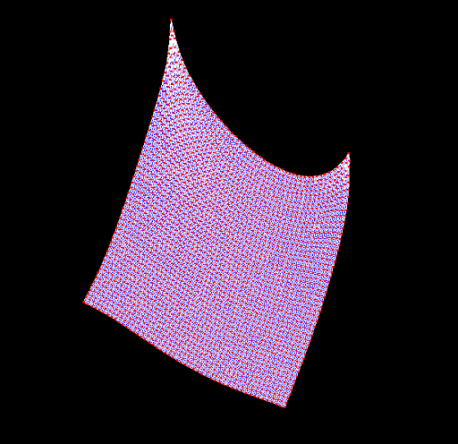
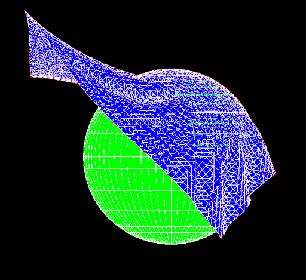
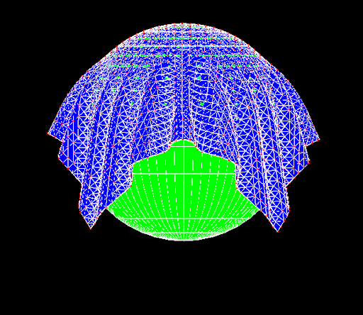
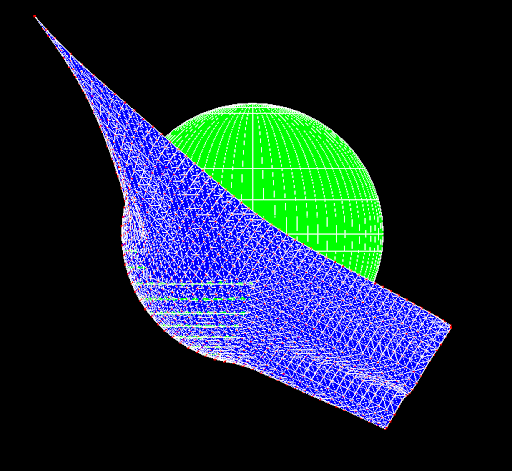

# Cloth Simulation

This is a cloth simulation project for CS 230 Computer Graphics. The cloth simulation uses the mass-spring model to represent the cloth.

Hanging Cloth:

Hanging Cloth Resting on Sphere:

Cloth Resting on Sphere:

Cloth Blown by Wind into Sphere:

